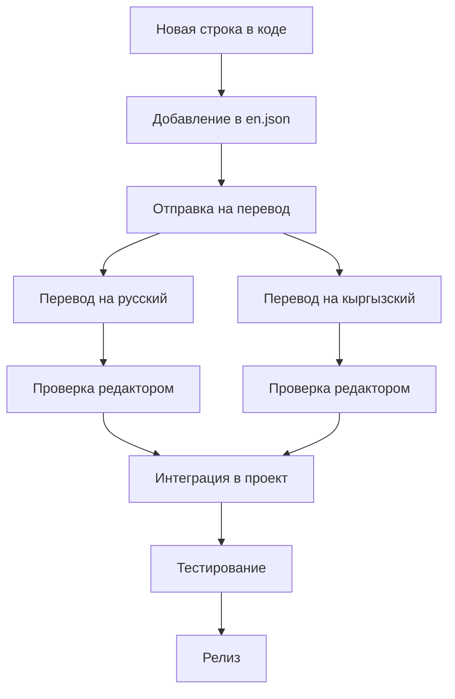
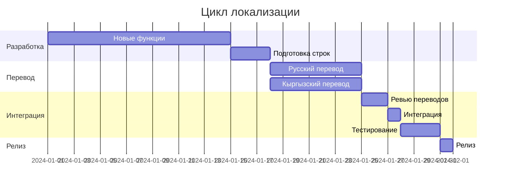

# План поддержки и обновления переводов

## Обзор

Данный документ описывает процессы и стратегии для долгосрочной поддержки системы локализации, включая управление переводами, работу с переводчиками и обновление контента.

## Организационная структура

### Роли и ответственности

#### 1. Менеджер локализации
- Координация всех процессов локализации
- Планирование и приоритизация переводов
- Контроль качества переводов
- Взаимодействие с переводчиками
- Отчетность по метрикам локализации

#### 2. Разработчики
- Подготовка строк для перевода
- Интеграция переводов в код
- Техническая поддержка системы локализации
- Автоматизация процессов

#### 3. Переводчики
- **Английский → Русский**: Носитель русского языка с техническим образованием
- **Английский → Кыргызский**: Носитель кыргызского языка, знание IT терминологии
- Проверка и корректировка существующих переводов

#### 4. Редакторы/Корректоры
- Финальная проверка переводов
- Обеспечение единообразия терминологии
- Контроль стиля и тона

## Процесс управления переводами

### 1. Жизненный цикл перевода



### 2. Приоритизация переводов

#### Высокий приоритет
- Критические ошибки и сообщения безопасности
- Основной пользовательский интерфейс
- Процесс оформления заказа
- Авторизация и регистрация

#### Средний приоритет
- Административная панель
- Дополнительные функции
- Справочная информация
- Уведомления

#### Низкий приоритет
- Техническая документация
- Редко используемые функции
- Экспериментальные возможности

### 3. Workflow для новых переводов

#### Шаг 1: Подготовка
```bash
# Создание задачи на перевод
npm run extract-new-strings
npm run create-translation-task
```

#### Шаг 2: Отправка переводчикам
- Экспорт строк в формате для переводчиков
- Предоставление контекста и скриншотов
- Установка дедлайнов

#### Шаг 3: Получение и интеграция
```bash
# Импорт переводов
npm run import-translations
npm run validate-translations
npm run test-translations
```

## Инструменты и автоматизация

### 1. Система управления переводами (TMS)

#### Рекомендуемые решения
- **Crowdin** - для совместной работы с переводчиками
- **Lokalise** - интеграция с GitHub
- **Phrase** - для больших команд
- **Weblate** - open-source решение

#### Интеграция с проектом
```yaml
# .github/workflows/translations.yml
name: Sync Translations

on:
  push:
    paths:
      - 'src/messages/en.json'

jobs:
  sync:
    runs-on: ubuntu-latest
    steps:
      - uses: actions/checkout@v3
      - name: Upload to Crowdin
        uses: crowdin/github-action@v1
        with:
          upload_sources: true
          upload_translations: false
        env:
          CROWDIN_PROJECT_ID: ${{ secrets.CROWDIN_PROJECT_ID }}
          CROWDIN_PERSONAL_TOKEN: ${{ secrets.CROWDIN_PERSONAL_TOKEN }}
```

### 2. Автоматизированные скрипты

#### Извлечение новых строк
```javascript
// scripts/extract-strings.js
const fs = require('fs');
const glob = require('glob');

function extractStrings() {
  const files = glob.sync('src/**/*.{ts,tsx}');
  const strings = new Set();
  
  files.forEach(file => {
    const content = fs.readFileSync(file, 'utf8');
    
    // Поиск useTranslations('namespace')
    const namespaceMatches = content.match(/useTranslations\(['"]([^'"]+)['"]\)/g);
    
    // Поиск t('key')
    const keyMatches = content.match(/t\(['"]([^'"]+)['"]\)/g);
    
    if (keyMatches) {
      keyMatches.forEach(match => {
        const key = match.match(/['"]([^'"]+)['"]/)[1];
        strings.add(key);
      });
    }
  });
  
  return Array.from(strings);
}

module.exports = { extractStrings };
```

#### Валидация переводов
```javascript
// scripts/validate-translations.js
const fs = require('fs');
const path = require('path');

function validateTranslations() {
  const languages = ['en', 'ru', 'kg'];
  const errors = [];
  
  const enTranslations = JSON.parse(
    fs.readFileSync('src/messages/en.json', 'utf8')
  );
  
  languages.slice(1).forEach(lang => {
    const filePath = `src/messages/${lang}.json`;
    
    if (!fs.existsSync(filePath)) {
      errors.push(`Missing translation file: ${filePath}`);
      return;
    }
    
    const translations = JSON.parse(fs.readFileSync(filePath, 'utf8'));
    
    // Проверка структуры
    const missingKeys = findMissingKeys(enTranslations, translations);
    if (missingKeys.length > 0) {
      errors.push(`Missing keys in ${lang}: ${missingKeys.join(', ')}`);
    }
    
    // Проверка плейсхолдеров
    const placeholderErrors = validatePlaceholders(enTranslations, translations);
    errors.push(...placeholderErrors);
  });
  
  if (errors.length > 0) {
    console.error('Translation validation errors:');
    errors.forEach(error => console.error(`  - ${error}`));
    process.exit(1);
  }
  
  console.log('✅ All translations are valid');
}

function findMissingKeys(source, target, prefix = '') {
  const missing = [];
  
  Object.keys(source).forEach(key => {
    const fullKey = prefix ? `${prefix}.${key}` : key;
    
    if (!(key in target)) {
      missing.push(fullKey);
    } else if (typeof source[key] === 'object') {
      missing.push(...findMissingKeys(source[key], target[key], fullKey));
    }
  });
  
  return missing;
}

function validatePlaceholders(source, target, prefix = '') {
  const errors = [];
  
  Object.keys(source).forEach(key => {
    const fullKey = prefix ? `${prefix}.${key}` : key;
    
    if (typeof source[key] === 'string' && typeof target[key] === 'string') {
      const sourcePlaceholders = (source[key].match(/\{[^}]+\}/g) || []).sort();
      const targetPlaceholders = (target[key].match(/\{[^}]+\}/g) || []).sort();
      
      if (JSON.stringify(sourcePlaceholders) !== JSON.stringify(targetPlaceholders)) {
        errors.push(`Placeholder mismatch in ${fullKey}: expected ${sourcePlaceholders.join(', ')}, got ${targetPlaceholders.join(', ')}`);
      }
    } else if (typeof source[key] === 'object') {
      errors.push(...validatePlaceholders(source[key], target[key], fullKey));
    }
  });
  
  return errors;
}

validateTranslations();
```

### 3. Мониторинг и алерты

#### GitHub Actions для проверки
```yaml
# .github/workflows/translation-check.yml
name: Translation Check

on:
  pull_request:
    paths:
      - 'src/messages/**'

jobs:
  validate:
    runs-on: ubuntu-latest
    steps:
      - uses: actions/checkout@v3
      - uses: actions/setup-node@v3
        with:
          node-version: '18'
      - run: npm ci
      - run: npm run validate-translations
      - run: npm run test-translations
```

#### Slack уведомления
```javascript
// scripts/notify-missing-translations.js
const { WebClient } = require('@slack/web-api');

async function notifyMissingTranslations() {
  const slack = new WebClient(process.env.SLACK_TOKEN);
  const missingCount = getMissingTranslationsCount();
  
  if (missingCount > 0) {
    await slack.chat.postMessage({
      channel: '#localization',
      text: `⚠️ Найдено ${missingCount} отсутствующих переводов. Требуется внимание переводчиков.`,
      blocks: [
        {
          type: 'section',
          text: {
            type: 'mrkdwn',
            text: `*Статус переводов*\n\n🔴 Отсутствует переводов: ${missingCount}\n\n<https://github.com/project/issues/new?template=translation.md|Создать задачу для переводчиков>`
          }
        }
      ]
    });
  }
}
```

## Работа с переводчиками

### 1. Онбординг новых переводчиков

#### Документация для переводчиков
```markdown
# Руководство для переводчиков

## Общие принципы
1. Сохраняйте технические термины на английском, если нет устоявшегося перевода
2. Используйте формальный стиль обращения
3. Соблюдайте единообразие терминологии
4. Учитывайте контекст использования

## Глоссарий терминов
- Login → Вход (не "Логин")
- Dashboard → Панель управления
- Cart → Корзина
- Checkout → Оформление заказа

## Ограничения по длине
- Кнопки: максимум 15 символов
- Заголовки: максимум 50 символов
- Уведомления: максимум 100 символов
```

### 2. Процесс обратной связи

#### Еженедельные встречи
- Обзор новых переводов
- Обсуждение сложных терминов
- Планирование работы на неделю
- Решение спорных вопросов

#### Система комментариев
```json
{
  "auth": {
    "login": {
      "value": "Вход",
      "comment": "Используется в кнопке входа, должно быть коротким",
      "context": "Button text for user authentication",
      "maxLength": 10
    }
  }
}
```

### 3. Контроль качества

#### Чек-лист для переводчиков
- [ ] Перевод соответствует контексту
- [ ] Соблюдена терминология из глоссария
- [ ] Длина текста не превышает ограничений
- [ ] Проверена грамматика и орфография
- [ ] Сохранены все плейсхолдеры
- [ ] Учтены культурные особенности

#### Процесс ревью
1. **Первичный перевод** - переводчик
2. **Техническая проверка** - автоматизированная
3. **Лингвистическая проверка** - редактор
4. **Финальное утверждение** - менеджер локализации

## Планирование и бюджетирование

### 1. Оценка объемов работ

#### Метрики для планирования
- **Слов в час**: 300-500 для технических текстов
- **Стоимость за слово**: $0.08-0.15 для русского, $0.10-0.20 для кыргызского
- **Время на ревью**: 20% от времени перевода
- **Время на интеграцию**: 10% от времени перевода

#### Ежемесячный бюджет
```
Плановые расходы на локализацию:

💰 Переводы:
   - Русский: $800/месяц
   - Кыргызский: $400/месяц

🔧 Инструменты:
   - TMS платформа: $50/месяц
   - Автоматизация: $100/месяц

👥 Управление:
   - Менеджер локализации: 20% ставки
   - Редакторы: $300/месяц

📊 Итого: ~$1,650/месяц
```

### 2. Планирование релизов

#### Цикл релизов
- **Спринт 1-2**: Разработка функций, подготовка строк
- **Спринт 3**: Отправка на перевод
- **Спринт 4**: Получение переводов, интеграция
- **Спринт 5**: Тестирование, исправления
- **Спринт 6**: Релиз

#### Критический путь


## Мониторинг и метрики

### 1. KPI локализации

#### Качественные метрики
- **Покрытие переводов**: % переведенных строк
- **Качество переводов**: оценка пользователей
- **Время отклика**: от запроса до готового перевода
- **Количество ошибок**: найденных после релиза

#### Количественные метрики
- **Объем переводов**: слов в месяц
- **Стоимость перевода**: $ за слово
- **Производительность**: слов в час
- **Использование языков**: % пользователей по языкам

### 2. Отчетность

#### Еженедельный отчет
```markdown
# Отчет по локализации - Неделя 15

## Выполненная работа
- ✅ Переведено 1,250 слов на русский
- ✅ Переведено 800 слов на кыргызский
- ✅ Интегрировано 15 новых строк
- ✅ Исправлено 3 ошибки в переводах

## Метрики
- 📊 Покрытие: RU 98%, KG 95%
- ⏱️ Среднее время перевода: 2.3 дня
- 💰 Стоимость: $0.12 за слово
- 🐛 Найдено ошибок: 2

## Планы на следующую неделю
- 🎯 Завершить перевод админ-панели
- 🔍 Провести аудит терминологии
- 📝 Обновить глоссарий
- 🧪 Протестировать новые переводы

## Проблемы и риски
- ⚠️ Задержка с переводом на кыргызский (переводчик болеет)
- 💡 Предложение: найти backup переводчика
```

#### Месячный анализ
```markdown
# Месячный анализ локализации - Март 2024

## Достижения
- 🎉 Достигнуто 100% покрытие основного UI
- 📈 Увеличилось использование русского языка на 15%
- 🚀 Сокращено время перевода с 5 до 3 дней
- 💡 Внедрена автоматизация проверки переводов

## Статистика
- 📝 Переведено: 15,000 слов
- 💰 Потрачено: $1,800
- ⏱️ Сэкономлено времени: 40 часов (автоматизация)
- 👥 Удовлетворенность пользователей: 4.7/5

## Планы на апрель
- 🎯 Начать локализацию мобильного приложения
- 🔧 Интегрировать новую TMS платформу
- 📚 Создать базу знаний для переводчиков
- 🌍 Исследовать возможность добавления казахского языка
```

## Долгосрочная стратегия

### 1. Масштабирование

#### Добавление новых языков
1. **Анализ рынка** - исследование потребности
2. **Поиск переводчиков** - носители языка с техническим опытом
3. **Адаптация процессов** - обновление инструментов и workflow
4. **Пилотный запуск** - тестирование на ограниченной аудитории
5. **Полный запуск** - после успешного пилота

#### Автоматизация переводов
- **Machine Translation** - для первичных черновиков
- **Translation Memory** - переиспользование переводов
- **Терминологические базы** - автоматическая проверка терминов
- **AI-ассистенты** - помощь переводчикам

### 2. Оптимизация процессов

#### Continuous Localization
```yaml
# Непрерывная локализация
steps:
  1. Разработчик добавляет строку
  2. Автоматическое извлечение в TMS
  3. Уведомление переводчиков
  4. Перевод в течение 24 часов
  5. Автоматическая интеграция
  6. Тестирование и релиз
```

#### Предиктивная аналитика
- Прогнозирование объемов переводов
- Оптимизация загрузки переводчиков
- Планирование бюджета на основе данных
- Выявление проблемных областей

### 3. Развитие команды

#### Обучение и развитие
- Регулярные тренинги по новым технологиям
- Участие в конференциях по локализации
- Сертификация переводчиков
- Обмен опытом с другими командами

#### Мотивация и удержание
- Система бонусов за качество
- Карьерный рост внутри команды
- Гибкий график работы
- Интересные и разнообразные проекты

## Заключение

Эффективная поддержка и обновление переводов требует:

1. **Четких процессов** - от планирования до релиза
2. **Качественных инструментов** - автоматизация рутинных задач
3. **Профессиональной команды** - переводчики, редакторы, менеджеры
4. **Постоянного мониторинга** - метрики и обратная связь
5. **Долгосрочного планирования** - стратегия развития

При соблюдении этих принципов система локализации будет масштабируемой, эффективной и обеспечит высокое качество пользовательского опыта для всех поддерживаемых языков.